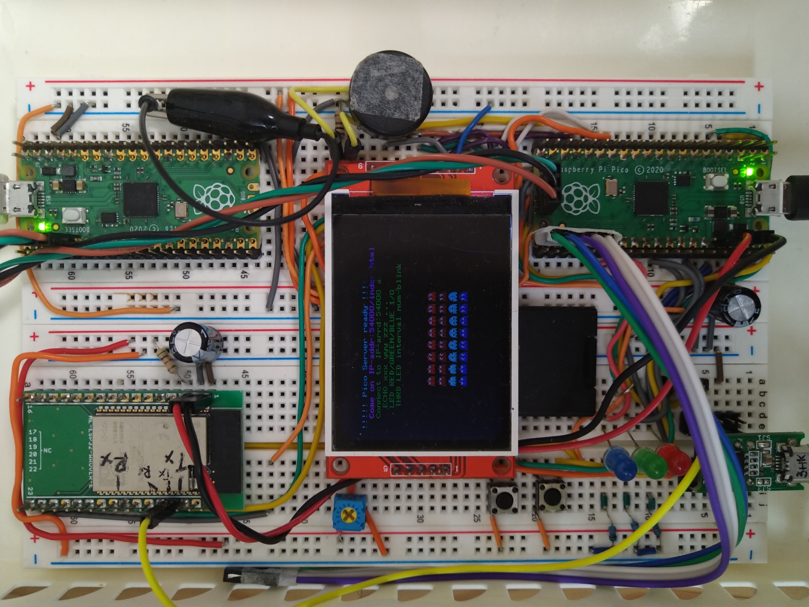

## Raspberry Pi Pico Pin assignment
<pre>
---STDIN/STDOUT---
PIN 1/GPIO0	: UART0_Tx	// To USB-COM for serial console(STDOUT)
PIN 2/GPIO1	: UART0_Rx	// To USB-COM for serial console(STDIN)
PIN 3/		: GND
 ---ESP32 control---
PIN 6/GPIO4	: UART1_Tx	// To ESP32_Tx (PIN31/IO19)
PIN 7/GPIO5	: UART1_Rx	// To ESP32_Rx (PIN36/IO22)
PIN 8/		: GND
PIN 9/GPIO6	: UART1_CTS	// To ESP32_RTS(PIN13/IO14), H/W flow control
PIN10/GPIO7	: UART1_RTS	// To ESP32_CTS(PIN23/IO15), H/W flow control
 ---LCD out and speaker out---
PIN14/GPIO10	: Speaker IO out// To Speaker (Active High)
PIN15/GPIO11	: CS IO out	// To 240x320LCD_CS(PIN3)
PIN16/GPIO12	: D/C IO out	// To 240x320LCD_D/C(PIN5)
PIN17/GPIO13	: RESET IO out	// To 240x320LCD_RESET(PIN4)
PIN18/		: GND		// To 240x320GND
PIN19/GPIO14	: SPI1_CLK 	// To 240x320LCD_SCK(PIN7)
PIN20/GPIO15	: SPI1_MOSI(TX)	// To 240x320LCD_MOSI(PIN6)
 ---LEDs---
PIN26/GPIO20	: BLUE_LED
PIN31/GPIO26	: GREEN_LED
PIN34/GPIO28	: RED_LED
</pre>

## How to use
<pre>
1. Simple HTTP server : Come on IP-addr:54000/index.html with your browser like Chrome
	Simple HTTP server supporting GET/POST.
	The input from operator to be replied on POST method. 
2. Command server : Connect to IP-arrd:54000 and send one command of the follows;
	ECHO xxx yyy zzz ...  => echo "xxx yyy zzz ..."
	LED RED/GREEN/BLUE 1/0 => LED on or off of RED(GPIO28) or BLUE(GPIO20) or GREEN(GPIO26)
	THRD LED interval num-blink => LED blink on core1, interval(msec) num-blink(0 then infinite), Input "KILL" to stop blinking 
3. Note that CTS/RTS must be enabled on both PICO and ESP32 as H/W flow control is requied.
	PICO: uart_set_hw_flow(uart1, true, true);
	ESP32: Ex. AT+UART_CUR=115200,8,1,0,3 and AT+UART_DEF=115200,8,1,0,3 then power cycle
</pre>

## Breadboard

## Under construction but ...
<pre>
Implementing simple file system on SD card
Implementing the function to upload a file to the file system.

PIN21/GPIO16	: SPI0_MISO(Rx) To 240x320SD_MISO(Tx, PIN3)
PIN22/GPIO17	: SPI0_CS To 240x320SD_CS(PIN1)
PIN23/		: GND
PIN24/GPIO18	: SPI0_SCK To 240x320SD_SCK(PIN4)
PIN25/GOPI19	: SPIO_MOSI(Tx) To 240x320SD_MOSI(Rx, PIN2)
</pre>

## Refereces and Citations
<pre>
With regard to graphlib.c, graphlib.h, ili9341.c and LCDdrive.h, the following repository is refferd.
https://github.com/KenKenMkIISR/picopacman  
With regard to ESP32 functions in esp32.cpp/h, server.cpp/h, the following repository is refferd.
https://github.com/RaresAil/rpi-pico-esp-cpp  
Face image of const char face[] in contents.utf8/sjis is obtained from https://daeudaeu.com/wp-content/uploads/2021/03/image.jpg.
</pre>
